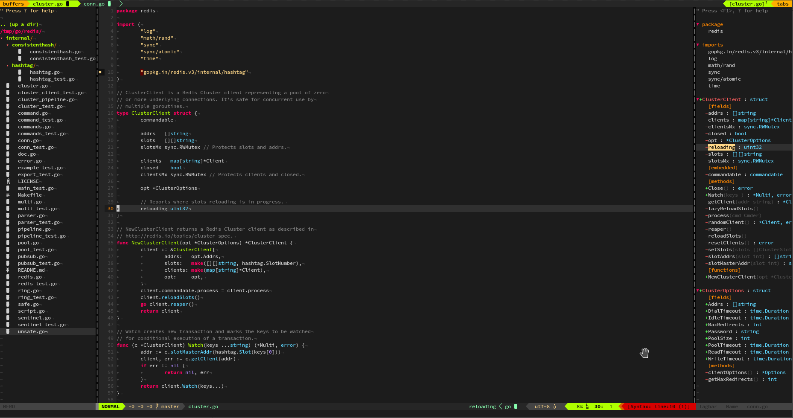

# monkey-vim

其他语言版本：[English](README.md)

## 简介

monkey-vim项目，旨在打造一个强大、快速的纯终端原生IDE。

**定位：** monkey-vim 面向纯终端环境 —— 不支持 GUI、gvim，不内建终端复用。适用环境：

| 环境 | 说明 |
|---|---|
| Linux 终端 | xterm, kitty, alacritty, wezterm, gnome-terminal 等 |
| macOS 终端 | Terminal.app, iTerm2, kitty 等 |
| WSL | Windows Subsystem for Linux（推荐 WSL2） |
| 服务器 TTY | 原生 Linux 控制台（tty1–tty63），256 色降级 |
| kmscon | Kernel Mode Setting 控制台 —— 支持真彩色和 Unicode 的现代 TTY 替代方案 |

窗口/分屏管理交给 tmux 或终端模拟器的原生标签页。

## 截图



## 要求

- vim 9.0+
- 终端环境（不支持 GUI / gvim）

## 安装步骤

### 1. clone到本地

```bash
git clone https://github.com/QMonkey/monkey-vim.git
```

### 2. 安装依赖

#### 2.1 通用工具

| 工具 | 用途 | 是否必须 |
|---|---|---|
| curl | 插件管理器引导 | 是 |
| git | 插件管理器、vim-fugitive | 是 |
| [ripgrep (rg)](https://github.com/BurntSushi/ripgrep) | ctrlsf 代码搜索 + LeaderF Rg 后端 | 是 |
| universal-ctags | gutentags 标签生成 | 是 |
| cmake | 编译 LeaderF C 扩展 | 是（仅编译时） |

```bash
# Ubuntu/Debian
sudo apt-get install curl git ripgrep universal-ctags cmake

# Arch Linux
sudo pacman -S curl git ripgrep ctags cmake

# macOS
brew install curl git ripgrep universal-ctags cmake
```
#### 2.2 LSP 服务器

Language Server Protocol 支持由 [yegappan/lsp](https://github.com/yegappan/lsp) 插件提供。请根据需要安装对应语言的服务器：

| 语言 | LSP 服务器 | 安装方式 |
|---|---|---|
| C/C++ | clangd | `sudo apt-get install clangd` 或 `brew install llvm` |
| Go | gopls | `go install golang.org/x/tools/gopls@latest` |
| Python | python-lsp-server | `pip install python-lsp-server` |
| Rust | rust-analyzer | `rustup component add rust-analyzer` |
| Lua | lua-language-server | `sudo apt-get install lua-language-server` 或 `brew install lua-language-server` |
| Shell | bash-language-server | `npm install -g bash-language-server` |
| Vim | vim-language-server | `npm install -g vim-language-server` |
| JavaScript | typescript-language-server | `npm install -g typescript-language-server typescript` |
| TypeScript | typescript-language-server | `npm install -g typescript-language-server typescript` |
| JSON | vscode-json-language-server | `npm install -g vscode-langservers-extracted` |
| YAML | yaml-language-server | `npm install -g yaml-language-server` |
| Markdown | marksman | `sudo apt-get install marksman` 或 `brew install marksman` |

#### 2.3 C/C++

```bash
# Ubuntu
sudo apt-get install gcc g++ clangd clang-format

# macOS
brew install gcc llvm clang-format
```

#### 2.4 Go

```bash
# 请安装最新版本的 go，然后：
go install golang.org/x/tools/gopls@latest
```

#### 2.5 Python

```bash
pip install python-lsp-server
# 可选：代码格式化与检查工具
pip install autopep8 flake8 pylint
```

#### 2.6 JavaScript / TypeScript

```bash
# 安装 LSP 服务器
npm install -g typescript-language-server typescript
```

#### 2.7 Rust

```bash
# 通过 rustup 安装 rust-analyzer
rustup component add rust-analyzer
```

#### 2.8 YAML

```bash
# 安装 LSP 服务器
npm install -g yaml-language-server
```

#### 2.9 Markdown

终端/WSL 下预览 Markdown：
```bash
# 方案一：glow（终端 Markdown 渲染器）
# https://github.com/charmbracelet/glow
brew install glow  # 或：go install github.com/charmbracelet/glow@latest

# 方案二：在 Windows 浏览器中打开（仅 WSL）
# :!explorer.exe %
```

#### 2.10 字体（可选）

Vim 使用的 Unicode 字符（⎇, │, 🔒, ▸, ·, ¬）无需额外字体即可正常显示。如需 Powerline 风格外观，可选择性安装 [Nerd Font](https://github.com/ryanoasis/nerd-fonts)（如 Hack Nerd Font）。

- [Hack Nerd Font](https://github.com/ryanoasis/nerd-fonts/tree/master/patched-fonts/Hack)

### 3. 安装

- Linux、Mac、WSL 和 kmscon

```bash
cd monkey-vim
ln -s $(pwd)/.vimrc ~/.vimrc
vim
```

### 4. kmscon 安装与使用（可选）

[kmscon](https://github.com/dvdhrm/kmscon) 是基于 Linux KMS/DRM 的系统级终端，替代传统的 Linux tty，提供完整的 Unicode 支持、multi-seat 能力和真彩色渲染。它是 monkey-vim 在无头服务器上的绝佳搭档。

#### 4.1 安装 kmscon

```bash
# Ubuntu/Debian
sudo apt-get install kmscon

# Arch Linux
sudo pacman -S kmscon

# 从源码编译
git clone https://github.com/dvdhrm/kmscon.git
cd kmscon
./autogen.sh
./configure --prefix=/usr
make
sudo make install
```

#### 4.2 用 kmscon 替代 tty（永久生效）

让 kmscon 取代传统的 tty/getty 成为默认系统控制台：

```bash
# 停止 tty1 上原有的 getty
sudo systemctl stop getty@tty1.service
sudo systemctl disable getty@tty1.service

# 为 tty1 创建 kmscon systemd 服务
sudo mkdir -p /etc/systemd/system/getty.target.wants
sudo ln -s /usr/lib/systemd/system/kmsconvt@.service \
    /etc/systemd/system/getty.target.wants/kmsconvt@tty1.service

# 在 tty1 上启动 kmscon
sudo systemctl start kmsconvt@tty1.service
```

重启后，按 `Ctrl+Alt+F1` 即可切换到支持真彩色和 Unicode 的 kmscon 终端。可按需对 tty2–tty6 重复相同操作。

如需保留自动登录功能（例如在无头开发服务器上）：

```bash
# 覆写 kmscon 服务以启用自动登录
sudo systemctl edit kmsconvt@tty1.service

# 添加以下内容：
[Service]
ExecStart=
ExecStart=/usr/bin/kmscon "--vt=%I" --seats=seat0 --no-switchvt \
    --login -- /usr/bin/agetty --autologin 你的用户名 --noclear %I
```

配置后 `Ctrl+Alt+F1` 将直接进入 kmscon 会话，支持 vim 的真彩色和完整 Unicode 渲染。

#### 4.3 在 kmscon 中运行 vim

手动方式，用于单次会话：

```bash
# 在空闲 tty 上启动 kmscon 并直接运行 vim
sudo kmscon --login -- /usr/bin/vim

# 或切换到已有的 kmscon 会话并启动 vim
sudo kmscon --switch
```

#### 4.4 颜色支持

kmscon 支持真彩色（24-bit）。monkey-vim 通过 `has('termguicolors')` 自动检测并使用 GUI 颜色渲染。

如果在传统 Linux tty（tty1–tty63）上运行，monkey-vim 将自动降级到 256 色模式，并启用 molokai 的 `rehash256` 调色板以准确逼近主题颜色。

#### 4.5 字体（可选）

kmscon 使用系统内建的字体渲染器。如需 Powerline 风格图标，可选择性安装 Nerd Font：

```bash
# 下载并安装 Hack Nerd Font 到系统目录（可选）
wget https://github.com/ryanoasis/nerd-fonts/releases/latest/download/Hack.zip
sudo unzip -o Hack.zip -d /usr/share/fonts/truetype/hack
sudo fc-cache -fv
```

## 更新

```bash
cd monkey-vim
git pull
```

```vim
:PlugInstall
:PlugUpdate
:PlugUpgrade
:PlugClean
```

## 插件列表

| 插件 | 用途 |
|---|---|
| [yegappan/lsp](https://github.com/yegappan/lsp) | Language Server Protocol 客户端 |
| [hrsh7th/vim-vsnip](https://github.com/hrsh7th/vim-vsnip) | 代码片段引擎 |
| [Yggdroot/LeaderF](https://github.com/Yggdroot/LeaderF) | 模糊文件/缓冲/tag 查找 |
| [dyng/ctrlsf.vim](https://github.com/dyng/ctrlsf.vim) | 异步代码搜索（rg/ag 后端） |
| [skywind3000/asyncrun.vim](https://github.com/skywind3000/asyncrun.vim) | 异步命令执行 |
| [itchyny/lightline.vim](https://github.com/itchyny/lightline.vim) | 状态栏 |
| [tomasr/molokai](https://github.com/tomasr/molokai) | 配色方案 |
| [mg979/vim-visual-multi](https://github.com/mg979/vim-visual-multi) | 多光标编辑 |
| [monkoose/vim9-stargate](https://github.com/monkoose/vim9-stargate) | 快速跳转（替代 vim-sneak） |
| [tpope/vim-fugitive](https://github.com/tpope/vim-fugitive) | Git 集成 |
| [airblade/vim-gitgutter](https://github.com/airblade/vim-gitgutter) | Git 差异标记 |
| [ludovicchabant/vim-gutentags](https://github.com/ludovicchabant/vim-gutentags) | 自动生成 ctags |
| [justinmk/vim-dirvish](https://github.com/justinmk/vim-dirvish) | 目录浏览器（替代 netrw） |
| [tpope/vim-surround](https://github.com/tpope/vim-surround) | 围绕字符编辑 |
| [svermeulen/vim-subversive](https://github.com/svermeulen/vim-subversive) | 使用剪贴板替换 |
| [andymass/vim-matchup](https://github.com/andymass/vim-matchup) | 增强 % 匹配跳转 |
| [wellle/targets.vim](https://github.com/wellle/targets.vim) | 更多文本对象 |
| [michaeljsmith/vim-indent-object](https://github.com/michaeljsmith/vim-indent-object) | 基于缩进的文本对象 |
| [cohama/lexima.vim](https://github.com/cohama/lexima.vim) | 自动配对括号 |
| [tpope/vim-repeat](https://github.com/tpope/vim-repeat) | 使插件映射支持 `.` 重复 |
| [tpope/vim-eunuch](https://github.com/tpope/vim-eunuch) | UNIX Shell 辅助命令（:W sudo保存等） |
| [tpope/vim-obsession](https://github.com/tpope/vim-obsession) | Session 管理 |
| [Konfekt/FastFold](https://github.com/Konfekt/FastFold) | 大文件折叠性能优化 |
| [haya14busa/vim-asterisk](https://github.com/haya14busa/vim-asterisk) | 增强 `*` / `#` 搜索 |
| [kshenoy/vim-signature](https://github.com/kshenoy/vim-signature) | 可视化书签 |
| [airblade/vim-rooter](https://github.com/airblade/vim-rooter) | 自动切换工作目录 |
| [romainl/vim-qf](https://github.com/romainl/vim-qf) | Quickfix/Location list 增强 |

## 快捷键

```
以下所有"Leader"键，都代表","键
```

### 1. 正常模式

#### 1.1 按键修改

```
s       用剪贴板的内容替换文本对象选中的字符串（如 siw 替换当前词）
S       用剪贴板的内容替换当前光标到行尾的文本
Y       复制到行尾，相当于"y$"命令
H       跳到当前行第一个非空字符,相当于"^"命令
L       跳到当前行最后一个字符,相当于"$"命令
U       Redo，相当于"Ctrl-r"
;       进入命令行模式，相当于":"键
q       退出窗口，相当于命令":q"
Shift+q  退出vim，相当于命令":qa"
t       记录操作，相当于原来的q（普通模式和可视化模式）

j       移至下一显示行（gj），在折行中正常移动
k       移至上一显示行（gk），在折行中正常移动
f       搜索 1 个字符跳转（stargate）
F       搜索 2 个连续字符跳转（stargate）
```

以下按键在插入模式和命令行模式下均适用：

```
Ctrl+p  上移        (Up)
Ctrl+n  下移        (Down)
Ctrl+b  左移        (Left)
Ctrl+f  右移        (Right)
Ctrl+a  跳到行首    (Home)
Ctrl+e  跳到行尾    (End)
Ctrl+h  退格        (BackSpace)
Ctrl+d  向前删除    (Del)
```

#### 1.2 F1 ~ F4

```
F1      打开 CtrlSF 搜索提示
F2      切换 CtrlSF 搜索窗口
F3      异步 Make
F4      异步执行任意命令
```

#### 1.3 缓冲

```
Leader+o    输入打开文件的路径，并在当前窗口打开一个缓冲
[+b         切换到上一个缓冲
]+b         切换到下一个缓冲
```

#### 1.4 分屏

```
Leader+s    输入打开文件的路径，并创建一个水平分屏的窗口
Leader+v    输入打开文件的路径，并创建一个垂直分屏的窗口

Ctrl+h      跳转到左窗口
Ctrl+j      跳转到下窗口
Ctrl+k      跳转到上窗口
Ctrl+l      跳转到右窗口
Leader+z    窗口放大/恢复
```

#### 1.5 Tab

```
Leader+t      输入打开的文件路径，并创建一个新tab窗口

[+t         切换到上一个tab窗口
]+t         切换到下一个tab窗口
Leader+1~9  切换到第1~9个tab窗口
Leader+[    切换到第一个tab窗口
Leader+]    切换到最后一个tab窗口
```

#### 1.6 查找（vim-asterisk）

按 `*` 或 `#` 会高亮光标下的所有单词但不跳转。再次按下则正常跳转。

```
*       高亮当前词，不跳转（再按跳转）
g*      同上，部分匹配
#       同上，反向
g#      同上，反向部分匹配
```

#### 1.7 替换（vim-subversive）

```
s{文本对象}  用剪贴板内容替换一个文本对象（如 siw 替换当前词）
ss          用剪贴板内容替换当前整行
S           用剪贴板内容替换从光标到行尾
```

#### 1.8 LSP（Language Server Protocol）

```
K                   查看光标所在符号的文档说明
gh                  在弹出窗口中显示文档

gd                  跳转到定义
gc                  跳转到声明
gt                  跳转到类型定义
gi                  跳转到实现
gr                  查看引用

Leader+gd           预览定义
Leader+gc           预览声明
Leader+gt           预览类型定义
Leader+gi           预览实现
Leader+gr           预览引用

Leader+rn           重命名符号
[d                  上一个诊断
]d                  下一个诊断
[D                  第一个诊断
]D                  最后一个诊断
Leader+gh           显示当前行诊断
```

#### 1.9 文件/缓冲/Tag 导航（LeaderF）

```
Ctrl+p      搜索文件
Ctrl+m      搜索缓冲
Ctrl+t      搜索当前文件Tag
Ctrl+y      搜索当前文件函数
Ctrl+e      搜索当前文件行
```

#### 1.10 Fold

以下是 Vim 内建折叠按键，由 FastFold 插件优化大文件性能：

```
za      当光标下的折叠打开时，关闭它。当折叠关闭时，打开它
zc      关闭光标下的折叠
zo      打开光标下的折叠
zR      打开所有折叠
zM      关闭所有折叠
```

#### 1.11 Marks（vim-signature）

```
m[a-zA-Z]   添加/删除标记
m,          添加下一个可用的标记
m.          如果当前行没有标记，添加下一个可用标记。否则，删除第一个标记

dm[a-zA-Z]  删除标记[a-zA-Z]
m-          删除当前行的所有标记
m<Space>    删除当前buffer的所有标记

'[a-zA-Z]   跳转到标记[a-zA-Z]
]`          跳转到下一个标记
[`          跳转到上一个标记
`]          根据字母序列跳转到下一个标记
`[          根据字母序列跳转到上一个标记
m/          在Location List里，查看当前buffer的所有标记

m[0-9]      添加/删除自定义标记!@#$%^&*()

m<S-[0-9]>  删除相应的自定义标记
m<BS>       删除所有自定义标记

]-          跳转到下一个相同类型的自定义标记
[-          跳转到上一个相同类型的自定义标记
]=          跳转到下一个自定义标记
[=          跳转到上一个自定义标记
m?          在Location List里，查看当前buffer的所有自定义标记
```

#### 1.12 Dirvish（目录浏览器，替代netrw）

```
-           在当前窗口打开文件所在的文件夹
~           在当前窗口打开项目根路径或用户主目录

<CR>        进入目录或打开文件
o           在当前窗口打开
a           在水平分屏打开
i           在垂直分屏打开
t           在新标签页打开
-           返回上一级目录
```

#### 1.13 代码搜索（ctrlsf）

```
Leader+a        当前目录搜索光标所在的词
```

#### 1.14 围绕字符编辑（vim-surround）

```
ys+textobj+surroundA        在textobj指定的范围增A围绕字符
yss+surroundA               在当前行增加A围绕字符
ds+surroundA                删除A围绕字符
cs+surroundA+surroundB      将A围绕字符改成B围绕字符
```

#### 1.15 异步运行

```
F3      异步 Make
F4      异步运行任意命令
```

#### 1.16 其他

```
Leader+bs       保存session
Leader+rs       删除session

'.              最后一次变更的地方
''              跳回来的地方（最近两个位置跳转）
Ctrl+o          跳回，可用于多种类型跳转（符号跳转，定义跳转，屏幕跳转等）
Ctrl+i          继续上次跳转（与Ctrl+o操作相反），可用于多种类型跳转（符号跳转，定义跳转，屏幕跳转等）
Ctrl+^          打开上次编辑的文件
cod             切换diff模式
cop             切换paste模式
col             切换list模式
con             清除搜索高亮
Leader+cr       切换到当前文件所在项目根路径
Leader+space        去除行尾空白字符（:substitute）
Leader+Leader+space  去除行尾空白字符 + \\r（DOS 换行符）
Leader+q            打开/关闭quickfix
Leader+l            打开/关闭location list
```

### 2. 插入模式

#### 2.1 代码片段（vim-vsnip）

```
Ctrl+j      展开代码片段或跳转到下一个占位符
Ctrl+l      展开代码片段或向前跳转
Tab         跳转到下一个占位符
Shift+Tab   跳转到上一个占位符
```

### 3. 可视化模式

#### 3.1 按键修改

```
s       用剪贴板的内容替换选中文本
;       进入命令行模式，相当于":"键
<       减少缩进，保持选中
>       增加缩进，保持选中
```

#### 3.2 查找

```
*       正向查找选中的字符串（标准 vim 行为，由 vim-asterisk 增强）
#       逆向查找选中的字符串（标准 vim 行为，由 vim-asterisk 增强）
```

#### 3.3 替换

```
# '\r'代表换行

s{文本对象}  用剪贴板内容替换文本对象（如 siw）
ss          用剪贴板内容替换当前整行
S           用剪贴板内容替换光标到行尾
```

#### 3.4 快速跳转（vim9-stargate）

```
f           搜索1个字符并跳转
F           搜索2个连续字符并跳转（反向）
```

#### 3.5 代码搜索（ctrlsf）

```
Leader+a        当前目录搜索选中字符串
```

#### 3.6 围绕字符编辑（vim-surround）

```
S+surroundA     选中字符串增加A围绕字符
```

### 4. 命令行模式

```
Ctrl+p  上一条命令
Ctrl+n  下一条命令
Ctrl+a  跳到命令行最前
Ctrl+e  跳到命令行最后
```

## 常用命令

### 1. W（vim-eunuch）

```vim
" 使用root权限保存文件
:W
```

### 2. CtrlSF

```vim
" 递归搜索当前目录中包含 PATTERN 的代码
:CtrlSF[!] [PATTERN]
```

### 3. GutentagsUpdate

```vim
" 为当前文件生成tag
:GutentagsUpdate

" 为整个工程生成tag
:GutentagsUpdate!
```

### 4. LeaderF

```vim
" 搜索文件
:LeaderfFile [QUERY]

" 搜索缓冲区
:LeaderfBuffer [QUERY]

" 搜索项目 tags
:LeaderfTag [QUERY]

" 搜索当前文件 tags
:LeaderfBufTag [QUERY]

" 搜索函数
:LeaderfFunction [QUERY]

" 搜索 Marks
:LeaderfMarks [QUERY]
```

## 在vim中使用git

### 1. git for vim: [vim-fugitive](https://github.com/tpope/vim-fugitive)

```vim
" 相当于:!git [args]，但会先自动切换到仓库根目录。推荐使用 :Git 而非 :Gstatus, :Gcommit, :Gdiff 等
:Git [args]

" 常用示例：
:Git status
:Git diff
:Git commit
:Git log
:Git blame
:Git pull
:Git push
:Git checkout %

" 详细教程请参考以下视频
https://github.com/tpope/vim-fugitive#screencasts

" 或官方文档
:h fugitive.txt
```

### 2. Git 提交浏览器：[gv.vim](https://github.com/junegunn/gv.vim)

```vim
" 打开 Git 提交浏览器
:GV
```

## 注意事项

- monkey-vim默认tab的缩进为8个字符，不使用space替代tab。如果你喜欢tab缩进为4个字符，并且使用space替代tab。你可以将以下vim配置

```vim
set tabstop=8
set softtabstop=8
set shiftwidth=8
set noexpandtab
```

改为

```vim
set tabstop=4
set softtabstop=4
set shiftwidth=4
set expandtab
```

- Vim 剪贴板集成

monkey-vim 设置了 `clipboard=unnamed,unnamedplus`，vim 的复制/删除操作会自动同步到系统剪贴板。退出 vim 后，复制的内容仍然保留在系统剪贴板中（系统剪贴板由显示服务器/Wayland 合成器/终端管理，不受 vim 退出影响）。

如需独立的剪贴板管理工具（可选）：

| 工具 | 平台 | 用途 |
|---|---|---|
| [parcellite](https://parcellite.sourceforge.net/) | X11 | 轻量级剪贴板管理器，支持持久化历史 |
| [cliphist](https://github.com/sentriz/cliphist) | Wayland | wlroots 剪贴板历史管理 |
| 系统自带 | macOS/WSL | 系统剪贴板默认持久化，无需额外工具 |

## 推荐设置

- [源码构建vim](https://github.com/QMonkey/monkey-vim/wiki/Build-Vim-from-source)

- 在bashrc中加入以下Shell代码，即可在vim中查看man文档

```bash
export MANPAGER="env MAN_PN=1 vim -R +MANPAGER -"
```
