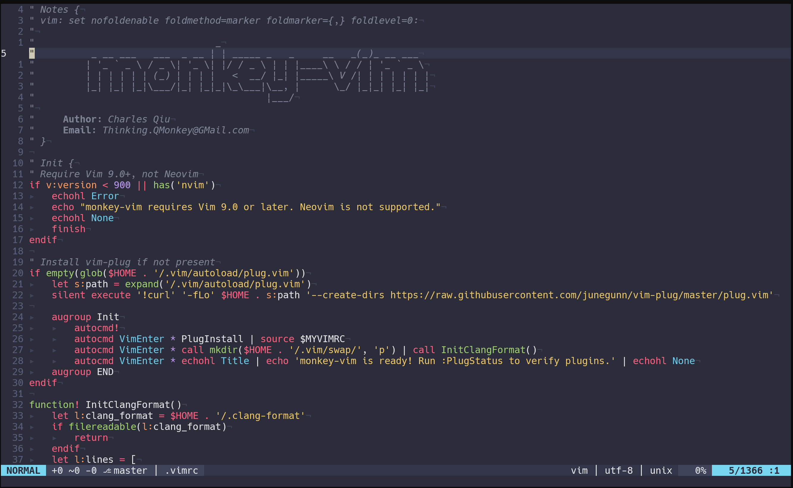

# monkey-vim

其他语言版本：[English](README.md)

## 简介

monkey-vim项目，旨在打造一个强大、快速的纯终端原生IDE。

**定位：** monkey-vim 面向纯终端环境 —— 不支持 GUI、gvim，不内建终端复用。适用环境：

| 环境       | 说明                                                                        |
| ---------- | --------------------------------------------------------------------------- |
| Linux 终端 | xterm, kitty, alacritty, wezterm, gnome-terminal 等                         |
| macOS 终端 | Terminal.app, iTerm2, kitty 等                                              |
| WSL        | Windows Subsystem for Linux（推荐 WSL2）                                    |
| 服务器 TTY | 原生 Linux 控制台（tty1–tty63），Vim 内置 8/16 色高亮（sonokai 需 ≥256 色） |
| kmscon     | Kernel Mode Setting 控制台 —— 支持真彩色和 Unicode 的现代 TTY 替代方案      |

多会话/多终端这类顶层工作区管理交给 tmux 或终端模拟器的标签页；编辑器内的分屏和标签页照常使用。

## 截图



## 要求

- vim 9.0+
- 终端环境（不支持 GUI / gvim）

## 安装步骤

### 1. clone到本地

```bash
git clone https://github.com/QMonkey/monkey-vim.git
```

### 2. 安装依赖

#### 2.1 通用工具

| 工具                                                          | 用途                                                                  | 是否必须 |
| ------------------------------------------------------------- | --------------------------------------------------------------------- | -------- |
| curl                                                          | 插件管理器引导                                                        | 是       |
| git                                                           | 插件管理器、vim-fugitive                                              | 是       |
| [ripgrep](https://github.com/BurntSushi/ripgrep) (rg)         | ctrlsf 代码搜索 + fzf.vim 文件搜索                                    | 是       |
| universal-ctags                                               | gutentags 标签生成                                                    | 是       |
| [GNU Global](https://www.gnu.org/software/global/) (`global`) | gutentags gtags（GTAGS）生成与导航                                    | 推荐     |
| [fzf](https://github.com/junegunn/fzf)                        | 模糊搜索器（fzf.vim 依赖）                                            | 是       |
| [bat](https://github.com/sharkdp/bat)                         | fzf 语法高亮文件预览                                                  | 推荐     |
| [Homebrew](https://brew.sh/)                                  | 系统仓库缺失时的后备包管理器（lua-language-server、marksman、fzf 等） | 必须     |

```bash
# 安装 Homebrew（所有 Linux 发行版 — 用于安装系统仓库中缺失的工具）
/bin/bash -c "$(curl -fsSL https://raw.githubusercontent.com/Homebrew/install/HEAD/install.sh)"
eval "$(/home/linuxbrew/.linuxbrew/bin/brew shellenv)"

# Ubuntu/Debian
sudo apt-get install curl git ripgrep universal-ctags global python3-pygments nodejs npm gcc
brew install fzf bat

# OpenSUSE
sudo zypper install curl git ripgrep universal-ctags global python3-Pygments fzf bat nodejs npm gcc

# CentOS（部分软件包来自 EPEL）
sudo dnf install epel-release
sudo dnf install curl git ripgrep universal-ctags global global-ctags python3-pygments fzf bat nodejs npm gcc

# Arch Linux
sudo pacman -S curl git ripgrep ctags global python-pygments fzf bat nodejs npm gcc

# macOS
brew install curl git ripgrep universal-ctags global pygments fzf bat node
```

#### 2.2 LSP 服务器

Language Server Protocol 支持由 [yegappan/lsp](https://github.com/yegappan/lsp) 插件提供。请根据需要安装对应语言的服务器：

| 语言       | LSP 服务器                  | 安装方式                                                                                                                                        |
| ---------- | --------------------------- | ----------------------------------------------------------------------------------------------------------------------------------------------- |
| C/C++      | clangd                      | `sudo apt-get install clangd`、`sudo zypper install clang`、`sudo dnf install clang-tools-extra`、`sudo pacman -S clang` 或 `brew install llvm` |
| Go         | gopls                       | `go install golang.org/x/tools/gopls@latest`                                                                                                    |
| Python     | python-lsp-server           | `pip3 install python-lsp-server`                                                                                                                |
| Zig        | zls                         | `brew install zls`（推荐，保持 zig/zls 版本一致）或从 <https://zigtools.org/zls/install/> 下载                                                  |
| Rust       | rust-analyzer               | `rustup component add rust-analyzer`                                                                                                            |
| Lua        | lua-language-server         | `brew install lua-language-server` 或 `sudo pacman -S lua-language-server`                                                                      |
| Shell      | bash-language-server        | `npm install -g bash-language-server`                                                                                                           |
| Vim        | vim-language-server         | `npm install -g vim-language-server`                                                                                                            |
| JavaScript | typescript-language-server  | `npm install -g typescript-language-server typescript`                                                                                          |
| TypeScript | typescript-language-server  | `npm install -g typescript-language-server typescript`                                                                                          |
| JSON       | vscode-json-language-server | `npm install -g vscode-langservers-extracted`                                                                                                   |
| YAML       | yaml-language-server        | `npm install -g yaml-language-server`                                                                                                           |
| Markdown   | marksman                    | `brew install marksman` 或 `sudo pacman -S marksman`                                                                                            |
| Markdown   | efm-langserver              | `go install github.com/mattn/efm-langserver@latest`                                                                                             |

部分 LSP 服务器会把格式化/检查交给**外部工具**，需单独安装。缺失时功能会静默降级（回退到内置诊断或跳过该工具）：

| 语言     | 工具              | 作用                                   | 安装方式                                                                                                                                            |
| -------- | ----------------- | -------------------------------------- | --------------------------------------------------------------------------------------------------------------------------------------------------- |
| C/C++    | clang-tidy        | linter（经 `clangd --clang-tidy`）     | `sudo apt-get install clang-tidy`、`sudo zypper install clang`、`sudo dnf install clang-tools-extra`、`sudo pacman -S clang` 或 `brew install llvm` |
| Go       | staticcheck       | linter（经 `gopls` 的 `staticcheck`）  | `go install honnef.co/go/tools/cmd/staticcheck@latest`                                                                                              |
| Shell    | shfmt             | formatter（经 `bash-language-server`） | `go install mvdan.cc/sh/v3/cmd/shfmt@latest`                                                                                                        |
| Python   | black             | formatter（经 `pylsp` 的 black 插件）  | `pip3 install black`                                                                                                                                |
| Markdown | prettier          | formatter（经 `efm-langserver`）       | `npm install -g prettier`                                                                                                                           |
| Markdown | markdownlint-cli2 | linter（经 `efm-langserver`）          | `npm install -g markdownlint-cli2`                                                                                                                  |

#### 2.3 C/C++

```bash
# Ubuntu/Debian
sudo apt-get install gcc g++ clangd clang-tidy

# OpenSUSE
sudo zypper install gcc gcc-c++ clang

# CentOS
sudo dnf install gcc gcc-c++ clang clang-tools-extra

# Arch Linux
sudo pacman -S gcc clang

# macOS
brew install gcc llvm
```

#### 2.4 Go

```bash
# 请安装最新版本的 go，然后：
go install golang.org/x/tools/gopls@latest
# 可选：staticcheck 检查器（gopls 使用）
go install honnef.co/go/tools/cmd/staticcheck@latest
```

#### 2.5 Python

```bash
# 需要 Python 3（如未安装请先通过系统包管理器安装）
pip3 install python-lsp-server
# 可选：代码格式化与检查工具（black 由 pylsp 的 black 插件使用）
pip3 install black autopep8 flake8 pylint
```

#### 2.6 JavaScript / TypeScript

```bash
# 安装 LSP 服务器
npm install -g typescript-language-server typescript
```

#### 2.7 Zig

Zig 的语法高亮、缩进和文件类型检测已内置于 Vim 9.2+，无需安装插件。只需安装 Zig 和 ZLS 语言服务器：

```bash
# 推荐：Homebrew 会保持 zig 与 zls 版本一致
brew install zig zls          # macOS / Linuxbrew

# 或下载版本匹配的预编译二进制：
#   zig: https://ziglang.org/download/
#   zls: https://zigtools.org/zls/install/
```

> **重要：** zls 与特定版本的 Zig 绑定，版本不匹配时会拒绝启动。请从同一来源安装 `zig` 和 `zls`（Homebrew 或官方下载工具）以保持一致。发行版软件包往往滞后：Ubuntu/Debian 稳定版没有 `zig` 包，Arch 的 `zls` 落后于 Arch 的 `zig`，通常不匹配。

保存时格式化由 ZLS 完成（与 `zig fmt` 一致），无需单独安装格式化工具。构建时诊断（`enable_build_on_save`）可在 `build.zig` 旁的 `zls.json` 中开启。

#### 2.8 Rust

```bash
# 安装 rustup（包含 rustc 和 cargo），然后：
rustup component add rust-analyzer
```

#### 2.9 YAML

```bash
# 安装 LSP 服务器
npm install -g yaml-language-server
```

#### 2.10 Shell

```bash
# 安装 LSP 服务器，以及它依赖的 shfmt 格式化工具
npm install -g bash-language-server
go install mvdan.cc/sh/v3/cmd/shfmt@latest
```

#### 2.11 Markdown

终端/WSL 下预览 Markdown：

```bash
# 方案一：glow（终端 Markdown 渲染器）
# https://github.com/charmbracelet/glow
brew install glow       # macOS / Linuxbrew
sudo pacman -S glow     # Arch Linux
sudo apt-get install glow  # Debian 13+
go install github.com/charmbracelet/glow@latest  # Ubuntu / OpenSUSE / CentOS，或任意平台（需安装 Go）

# 方案二：在 Windows 浏览器中打开（仅 WSL）
# :!explorer.exe %
```

格式化与检查由 [efm-langserver](https://github.com/mattn/efm-langserver) 提供（formatter: prettier，linter: markdownlint-cli2）：

```bash
go install github.com/mattn/efm-langserver@latest
npm install -g prettier markdownlint-cli2
# 将 efm 配置（config.yaml + .markdownlint.jsonc）软链到默认路径
ln -sf $(pwd)/configs/efm-langserver ~/.config/efm-langserver
```

#### 2.12 字体（可选）

Vim 使用的 Unicode 字符（⎇, │, ▸, ·, ¬）无需额外字体即可正常显示。如需 Powerline 风格外观，可选择性安装 [Nerd Font](https://github.com/ryanoasis/nerd-fonts)。

### 3. 健康检查

验证所有必需依赖和可选 LSP server 是否就绪：

```bash
./checkhealth.sh
```

加 `--install` 可自动安装缺失的依赖（必需工具 + 可选 LSP 服务器）。支持 apt/zypper/dnf/pacman/brew、npm、pip、go install 和 rustup：

```bash
./checkhealth.sh --install
```

### 4. 安装

- Linux、Mac、WSL 和 kmscon

```bash
cd monkey-vim
ln -sf $(pwd)/.vimrc ~/.vimrc
ln -sf $(pwd)/configs/.clang-format ~/.clang-format   # 全局 clang-format 风格（可选）
ln -sf $(pwd)/configs/efm-langserver ~/.config/efm-langserver   # efm：markdown 格式化/检查（可选）
vim
```

### 5. 更新

```bash
cd monkey-vim
git pull
```

```vim
:PlugInstall
:PlugUpdate
:PlugUpgrade
:PlugClean
```

### 6. kmscon 安装与使用（可选）

[kmscon](https://github.com/kmscon/kmscon) 是基于 Linux KMS/DRM 的系统级终端，替代传统的 Linux tty，提供完整的 Unicode 支持、multi-seat 能力和真彩色渲染。它是 monkey-vim 在无头服务器上的绝佳搭档。

#### 6.1 安装 kmscon

```bash
# Ubuntu/Debian（旧版，不含 terminfo）
sudo apt-get install kmscon

# OpenSUSE（Tumbleweed / Leap 15.x）
sudo zypper install kmscon

# Arch Linux
sudo pacman -S kmscon

# CentOS — 官方与 EPEL 仓库均未提供，改用下方源码编译
# 从源码编译（需要 meson、ninja 和 ncurses 提供的 tic）
git clone https://github.com/kmscon/kmscon.git
cd kmscon
meson setup builddir/
meson install -C builddir/
```

从源码编译时会自动通过 `tic` 编译并安装 kmscon 的 terminfo 条目，vim 无需任何 `TERM` 变通即可正确检测终端能力。默认安装 prefix 为 `/usr/local`，如需安装到系统路径请在 meson setup 时追加 `--prefix=/usr`。

在较旧的系统上，`libtsm` 等依赖版本可能不满足编译要求。此时使用包管理器版本并通过 6.3 节的 `TERM` 变通方案即可。

#### 6.2 用 kmscon 替代 tty（永久生效）

让 kmscon 取代传统的 tty/getty 成为默认系统控制台：

```bash
# 停止 tty1 上原有的 getty
sudo systemctl stop getty@tty1.service
sudo systemctl disable getty@tty1.service

# 为 tty1 创建 kmscon systemd 服务
sudo mkdir -p /etc/systemd/system/getty.target.wants
sudo ln -s /usr/lib/systemd/system/kmsconvt@.service \
    /etc/systemd/system/getty.target.wants/kmsconvt@tty1.service

# 覆写 ExecStart 使用 kmscon 自带的终端类型
sudo systemctl edit kmsconvt@tty1.service
```

添加以下覆写内容：

```ini
[Service]
ExecStart=
ExecStart=/usr/bin/kmscon "--vt=%I" --seats=seat0 --no-switchvt --login -- /sbin/agetty -o '-p -- \\u' - kmscon
```

最后一个参数 `kmscon` 是 agetty 的 `<termtype>` 位置参数，用于设置 `TERM=kmscon`，与编译时安装的 terminfo 条目匹配。

由于 `kmscon` 这个 terminfo 条目从 **10.0.0** 才开始随源码提供，不同版本的终端类型设置也不同：

```ini
# kmscon 10.0.0+（自带 scripts/terminfo/kmscon.ti，默认 TERM=kmscon）
ExecStart=/usr/bin/kmscon "--vt=%I" --seats=seat0 --no-switchvt --login -- /sbin/agetty -o '-p -- \\u' - kmscon

# kmscon 9.x（没有 kmscon terminfo 条目，改用 xterm-256color）
ExecStart=/usr/bin/kmscon "--vt=%I" --seats=seat0 --no-switchvt --login -- /sbin/agetty -o '-p -- \\u' - xterm-256color
```

如果你的 `agetty` 版本支持 `--noclear` 参数，可以在 `-` 之前加入它，以在登录提示符上保留 kmscon 启动画面；它纯粹是外观选项。

```bash
# 在 tty1 上启动 kmscon
sudo systemctl start kmsconvt@tty1.service
```

重启后，按 `Ctrl+Alt+F1` 即可切换到支持真彩色和 Unicode 的 kmscon 终端。可按需对 tty2–tty6 重复相同操作。

##### `start` 与 `enable` 的区别——常见坑

`systemctl start` 只是运行一次单元，完全不读取 `[Install]` 段，因此不会触碰 `autovt@.service`。`systemctl enable` 会读取 `[Install]` 并创建符号链接，包括 `Alias=autovt@.service`。

tty2–tty6 **并不**由 `getty.target.wants` 启动；systemd-logind 会把每个新激活的 VT 以 `autovt@ttyN.service` 的方式拉起，它通过 `autovt@.service` 这个别名来解析。Debian/Ubuntu 打包的 `kmsconvt@.service` 自带了该别名：

```ini
[Install]
WantedBy=getty.target
DefaultInstance=tty1
Alias=autovt@.service
```

因此：

- `systemctl enable kmsconvt@tty1.service` → 只影响 tty1（实例别名 `autovt@tty1.service`）。
- `systemctl enable kmsconvt@.service`（模板，不带 ttyN）→ **所有 VT**，因为它会创建 `/etc/systemd/system/autovt@.service -> kmsconvt@.service`。

上面的 `ln -s ... kmsconvt@tty1.service` + `start` 流程因此只作用于 tty1。如果发现 tty2–tty6 意外也变成了 kmscon，请检查残留的别名（回退方法见 6.5 节）。

#### 6.3 真彩色支持

kmscon 支持真彩色（24-bit）。monkey-vim 通过 `has('termguicolors')` 自动检测并使用 GUI 颜色渲染。

如果通过包管理器安装的 kmscon 版本较旧（不含 terminfo）或 terminfo 条目缺失，vim 会报错 `E558: Terminal entry not found in terminfo`。此时在 shell 配置中添加以下内容即可：

```bash
# 添加到 shell 配置文件中（~/.bashrc、~/.zshrc 等）
export TERM=xterm-256color
export COLORTERM=truecolor
```

`COLORTERM=truecolor` 必须在 `TERM=xterm-256color` 时设置，否则 vim 无法检测到真彩色支持。注意使用 `xterm-256color` 替代 kmscon 原生 terminfo 可能导致一定的终端刷新异常。如需最佳体验，请从源码（10.0.0+）编译获取原生 terminfo 条目。

如果在 kmscon 中使用 tmux，tmux 会把 `$TERM` 覆盖为 `tmux` / `tmux-256color`。这是正常且正确的行为——**不要**改回去。tmux 会根据外层终端生成自己的内部 `TERM` 并对外暴露准确的能力，vim 等 ncurses 程序因此能正确工作。只有**外层**（进入 tmux 之前）的 `$TERM` 才重要：10.0.0+ 保持 `kmscon`，9.x 保持 `xterm-256color`。

Linux 原生控制台（tty1–tty63，`TERM=linux`）只提供 8/16 色（`&t_Co < 256`），这会触发 sonokai 的守卫条件（`&t_Co < 256 -> finish`），从而保留 Vim 内置的 8/16 色高亮，保证代码仍可阅读。sonokai 本身并不要求真彩色——在任何 256 色终端上都能通过 `cterm` 调色板正常渲染——但它在可用颜色少于 256 时会拒绝加载。如需在物理控制台上获得完整的 sonokai 配色，请用 kmscon 替代 tty（见 6.2 节）或改用任意 256 色/真彩色终端。

如果在裸 tty（非 kmscon）上运行 tmux，tmux 默认 `default-terminal=tmux-256color`，会向其中的所有程序宣称「256 色 + xterm 风格键序列」——即便底层控制台只有 8/16 色。monkey-vim 已经能识别这种情况（它向上遍历进程树，看到 tmux 客户端背后的真实 tty），并回退到 Vim 内置高亮，因此 vim 自身始终正确。但其他程序没有这层保护，可能输出控制台无法显示的 256 色转义序列。要让它们也正确，把 tmux 的终端类型设为与 8 色控制台匹配：

```bash
# 写入 ~/.tmux.conf —— 仅适用于在裸 Linux tty 上运行的 tmux
set -g default-terminal "tmux"
set -g terminal-overrides ",linux:colors=16"
```

第一行让 tmux 向程序宣称普通的 8 色终端；第二行告诉 tmux 底层 `linux` 控制台有 16 色（8 基础色 + 8 亮色），使其能合理降级。**不要**在 kmscon 或普通终端模拟器下运行 tmux 时添加这两行——那些场景 `tmux-256color` 才是正确的。

#### 6.4 字体（可选）

kmscon 使用系统内建的字体渲染器。如需 Powerline 风格图标，安装任意系统等宽字体即可。

#### 6.5 回退到传统 tty/getty

将虚拟控制台交还给 agetty：

```bash
# 停止 kmscon 实例
sudo systemctl stop kmsconvt@tty1.service

# 删除 6.2 节创建的 tty1 wants 链接
sudo rm -f /etc/systemd/system/getty.target.wants/kmsconvt@tty1.service

# 在 tty1 上恢复 getty
sudo systemctl enable getty@tty1.service
sudo systemctl start getty@tty1.service
```

如果之前执行过 `systemctl enable kmsconvt@.service`（模板），`autovt@.service` 别名现在指向 kmscon，会继续替换所有 VT。需要显式回退：

```bash
# 让 autovt@.service 指回 getty（去掉 kmscon 别名）
sudo systemctl disable kmsconvt@.service
sudo rm -f /etc/systemd/system/autovt@.service

# 重新启用 getty（同时恢复 getty@tty1.service）
sudo systemctl enable getty@.service

# 重新加载，让 logind 对新激活的 VT 生效
sudo systemctl daemon-reload
```

验证别名已指回 getty：

```bash
readlink -f /etc/systemd/system/autovt@.service /usr/lib/systemd/system/autovt@.service
```

应解析到 `getty@.service`。

## 插件列表

| 插件                                                                                  | 用途                                              |
| ------------------------------------------------------------------------------------- | ------------------------------------------------- |
| [yegappan/lsp](https://github.com/yegappan/lsp)                                       | Language Server Protocol 客户端                   |
| [hrsh7th/vim-vsnip](https://github.com/hrsh7th/vim-vsnip)                             | 代码片段引擎                                      |
| [hrsh7th/vim-vsnip-integ](https://github.com/hrsh7th/vim-vsnip-integ)                 | LSP 片段集成                                      |
| [rafamadriz/friendly-snippets](https://github.com/rafamadriz/friendly-snippets)       | 常用代码片段集合                                  |
| [junegunn/fzf.vim](https://github.com/junegunn/fzf.vim)                               | 模糊文件/缓冲/tag 查找                            |
| [dyng/ctrlsf.vim](https://github.com/dyng/ctrlsf.vim)                                 | 异步代码搜索（rg/ag 后端）                        |
| [itchyny/lightline.vim](https://github.com/itchyny/lightline.vim)                     | 状态栏                                            |
| [sainnhe/sonokai](https://github.com/sainnhe/sonokai)                                 | 配色方案                                          |
| [mg979/vim-visual-multi](https://github.com/mg979/vim-visual-multi)                   | 多光标编辑                                        |
| [monkoose/vim9-stargate](https://github.com/monkoose/vim9-stargate)                   | 快速跳转（替代 vim-sneak）                        |
| [tpope/vim-fugitive](https://github.com/tpope/vim-fugitive)                           | Git 集成                                          |
| [airblade/vim-gitgutter](https://github.com/airblade/vim-gitgutter)                   | Git 差异标记                                      |
| [ludovicchabant/vim-gutentags](https://github.com/ludovicchabant/vim-gutentags)       | 自动生成 ctags 与 gtags（GNU Global）             |
| [justinmk/vim-dirvish](https://github.com/justinmk/vim-dirvish)                       | 目录浏览器（替代 netrw）                          |
| [tpope/vim-surround](https://github.com/tpope/vim-surround)                           | 围绕字符编辑                                      |
| [svermeulen/vim-subversive](https://github.com/svermeulen/vim-subversive)             | 使用剪贴板替换                                    |
| [andymass/vim-matchup](https://github.com/andymass/vim-matchup)                       | 增强 % 匹配跳转                                   |
| [wellle/targets.vim](https://github.com/wellle/targets.vim)                           | 更多文本对象                                      |
| [michaeljsmith/vim-indent-object](https://github.com/michaeljsmith/vim-indent-object) | 基于缩进的文本对象                                |
| [cohama/lexima.vim](https://github.com/cohama/lexima.vim)                             | 自动配对括号                                      |
| [tpope/vim-repeat](https://github.com/tpope/vim-repeat)                               | 使插件映射支持 `.` 重复                           |
| [tpope/vim-eunuch](https://github.com/tpope/vim-eunuch)                               | UNIX Shell 辅助命令（:SudoWrite、:W、:Delete 等） |
| [tpope/vim-obsession](https://github.com/tpope/vim-obsession)                         | Session 管理                                      |
| [Konfekt/FastFold](https://github.com/Konfekt/FastFold)                               | 大文件折叠性能优化                                |
| [haya14busa/vim-asterisk](https://github.com/haya14busa/vim-asterisk)                 | 增强 `*` / `#` 搜索                               |
| [kshenoy/vim-signature](https://github.com/kshenoy/vim-signature)                     | 可视化书签                                        |
| [airblade/vim-rooter](https://github.com/airblade/vim-rooter)                         | 自动切换工作目录                                  |
| [junegunn/gv.vim](https://github.com/junegunn/gv.vim)                                 | Git 提交浏览器                                    |
| [romainl/vim-qf](https://github.com/romainl/vim-qf)                                   | Quickfix/Location list 增强                       |

## 快捷键

```text
以下所有"Leader"键，都代表","键
```

### 1. 正常模式

#### 1.1 按键修改

```text
s       用剪贴板的内容替换文本对象选中的字符串（详见§1.7）
S       用剪贴板的内容替换当前光标到行尾的文本（详见§1.7）
Y       复制到行尾，相当于"y$"命令
H       跳到当前行第一个非空字符,相当于"^"命令
L       跳到当前行最后一个字符,相当于"$"命令
U       Redo，相当于"Ctrl-r"
;       进入命令行模式，相当于":"键
q       退出窗口（含 diff/fugitive/quickfix 特殊处理）
Shift+q  退出vim，相当于命令":qa"
t       记录操作，相当于原来的q（普通模式和可视化模式）

j       移至下一显示行（gj），在折行中正常移动
k       移至上一显示行（gk），在折行中正常移动
f       搜索 1 个字符跳转（stargate 带提示）
F       搜索 2 个连续字符跳转（stargate 带提示）
gs      选择单词/区域进行多光标编辑（vim-visual-multi）
```

以下按键在插入模式和命令行模式下均适用：

```text
Ctrl+p  上移        (Up)
Ctrl+n  下移        (Down)
Ctrl+b  左移        (Left)
Ctrl+f  右移        (Right)
Ctrl+a  跳到行首    (Home)
Ctrl+e  跳到行尾    (End)
Ctrl+h  退格        (BackSpace)
Ctrl+d  向前删除    (Del)
```

#### 1.2 F1 ~ F4

```text
F1      打开 CtrlSF 搜索提示
F2      切换 CtrlSF 搜索窗口
F3      打开终端窗口
F4      切换终端窗口（打开/隐藏）
```

#### 1.3 缓冲

```text
Leader+o    输入打开文件的路径，并在当前窗口打开一个缓冲
[+b         切换到上一个缓冲
]+b         切换到下一个缓冲
```

#### 1.4 分屏

```text
Leader+Leader+s    输入打开文件的路径，并创建一个水平分屏的窗口
Leader+Leader+v    输入打开文件的路径，并创建一个垂直分屏的窗口

Ctrl+h      跳转到左窗口
Ctrl+j      跳转到下窗口
Ctrl+k      跳转到上窗口
Ctrl+l      跳转到右窗口
Leader+z    窗口放大/恢复
```

#### 1.5 Tab

```text
Leader+Leader+t      输入打开的文件路径，并创建一个新tab窗口

[+t         切换到上一个tab窗口
]+t         切换到下一个tab窗口
Leader+1~9  切换到第1~9个tab窗口
Leader+[    切换到第一个tab窗口
Leader+]    切换到最后一个tab窗口
```

#### 1.6 查找（vim-asterisk）

按 `*` 或 `#` 会高亮光标下的所有单词但不跳转。再次按下则正常跳转。

```text
*       高亮当前词，不跳转（再按跳转）
g*      同上，部分匹配
#       同上，反向
g#      同上，反向部分匹配
```

#### 1.7 替换（vim-subversive）

```text
s{文本对象}  用剪贴板内容替换一个文本对象（如 siw 替换当前词）
ss          用剪贴板内容替换当前整行
S           用剪贴板内容替换从光标到行尾
```

#### 1.8 LSP（Language Server Protocol）

```text
K                   查看光标所在符号的文档说明
gh                  在弹出窗口中显示文档

gd                  跳转到定义（LSP 失败时 fallback 到 ctags）
gc                  跳转到声明
gt                  跳转到类型定义
gi                  跳转到实现
gr                  查看引用

Leader+gd           预览定义
Leader+gc           预览声明
Leader+gt           预览类型定义
Leader+gi           预览实现
Leader+gr           预览引用

Leader+rn           重命名符号
[d                  上一个诊断
]d                  下一个诊断
[D                  第一个诊断
]D                  最后一个诊断
Leader+gh           显示当前行诊断（弹窗）
Leader+d            显示/隐藏当前缓冲区所有诊断（位置列表）
```

文件在保存时自动通过 LSP 格式化。自动补全默认开启 — LSP 建议会自动弹出。
`K` 查找光标下的词：默认使用 `:Man`，LSP 文件类型使用 `:LspHover`，Vim/help 文件使用 `:help`。

#### 1.9 Cscope 与 Ctags

```text
gs                  查找光标所在符号（cscope）
gD                  查找全局定义（cscope，失败时 fallback 到 ctags）
gR                  查找调用者（cscope）
g]                  跳转到光标处的 tag，并在 quickfix 列出所有同名定义
```

Cscope 支持 `c`、`d`、`e`、`f`、`g`、`i`、`s`、`t` 查询类型，结果放入 quickfix。
需要安装 `cscope` 并配合 `gtags-cscope` 生成数据库（gutentags 会自动生成）。

#### 1.10 文件/缓冲/Tag 导航（fzf.vim）

```text
Ctrl+p      搜索文件

Leader+b    搜索缓冲（C-d 删除，Enter 打开）
Leader+t    搜索当前文件Tag
Leader+p    搜索项目Tag
Leader+f    搜索当前文件函数
Leader+e    搜索当前文件行
```

#### 1.11 Fold

以下是 Vim 内建折叠按键，由 FastFold 插件优化大文件性能：

```text
za      当光标下的折叠打开时，关闭它。当折叠关闭时，打开它
zc      关闭光标下的折叠
zo      打开光标下的折叠
zR      打开所有折叠
zM      关闭所有折叠
zuz     手动更新所有折叠（FastFold）
```

#### 1.12 Marks（vim-signature）

```text
m[a-zA-Z]   添加/删除标记
m,          添加下一个可用的标记
m.          如果当前行没有标记，添加下一个可用标记。否则，删除第一个标记

dm[a-zA-Z]  删除标记[a-zA-Z]
m-          删除当前行的所有标记
m<Space>    删除当前buffer的所有标记

'[a-zA-Z]   跳转到标记[a-zA-Z]
]` / [`     跳转到下一个 / 上一个标记
`] / `[     根据字母顺序跳转到下一个 / 上一个标记
m/          在Location List里，查看当前buffer的所有标记

m[0-9]      添加/删除自定义标记!@#$%^&*()

m<S-[0-9]>  删除相应的自定义标记
m<BS>       删除所有自定义标记

]-          跳转到下一个相同类型的自定义标记
[-          跳转到上一个相同类型的自定义标记
]=          跳转到下一个自定义标记
[=          跳转到上一个自定义标记
m?          在Location List里，查看当前buffer的所有自定义标记
```

`:SignatureToggle` 显示/隐藏标记（不删除）
`:SignatureRefresh` 标记与 sign 不同步时重新同步

#### 1.13 Dirvish（目录浏览器，替代netrw）

```text
-           在当前窗口打开文件所在的文件夹
~           在当前窗口打开项目根路径或用户主目录

<CR>        进入目录或打开文件
o           在当前窗口打开
a           在水平分屏打开
i           在垂直分屏打开
t           在新标签页打开
-           返回上一级目录
A/I/O       已禁用（请使用 a/i/o 代替）
x           将文件添加到 arglist
R           刷新目录视图
:Shdo       根据行内容生成 shell 脚本（如 :%Shdo）
```

#### 1.14 代码搜索（ctrlsf）

```text
Leader+a        当前目录搜索光标所在的词
```

#### 1.15 围绕字符编辑（vim-surround）

```text
ys+textobj+surroundA        在textobj指定的范围增A围绕字符
yss+surroundA               在当前行增加A围绕字符
ds+surroundA                删除A围绕字符
cs+surroundA+surroundB      将A围绕字符改成B围绕字符
```

#### 1.16 终端

```text
F3      打开终端窗口
F4      切换终端窗口（打开/隐藏）
```

F3 在底部新建一个终端。F4 切换终端 — 隐藏时不终止进程，再次打开时复用同一终端。

使用 `<Ctrl-\><Ctrl-n>` 从终端模式切换到普通模式。普通模式下 `<ScrollWheelUp>` 和 `<ScrollWheelDown>` 可滚动终端缓冲区。

#### 1.17 其他

```text
Leader+ws       保存session
Leader+rs       删除session（需确认；无 session 时不做任何事）
```

Session 保存到 `~/.cache/sessions/`。Vim 启动时自动从此目录恢复 session。

```text
'.              最后一次变更的地方
''              跳回来的地方（最近两个位置跳转）
Ctrl+o          跳回，可用于多种类型跳转（符号跳转，定义跳转，屏幕跳转等）
Ctrl+i          继续上次跳转（与Ctrl+o操作相反），可用于多种类型跳转（符号跳转，定义跳转，屏幕跳转等）
Ctrl+^          打开上次编辑的文件
cod             切换diff模式
cop             切换paste模式
col             切换list模式
con             清除搜索高亮
Leader+cr       切换到当前文件所在项目根路径（手动触发，不会自动切换）
cop             切换粘贴模式（退出插入模式时自动关闭）
Leader+space        去除行尾空白字符（:substitute）
Leader+Leader+space  去除行尾空白字符 + \\r（DOS 换行符）
Leader+q            打开/关闭quickfix
Leader+l            打开/关闭location list
```

在 quickfix/location 窗口中（ack 风格映射）：

- `o`/`Enter` — 打开条目（文件+行号）
- `go` — 在水平分屏中打开
- `gO` — 打开并聚焦新窗口
- `t` — 在新标签页中打开
- `T` — 在新标签页中打开（保持 quickfix 聚焦）
- `q` — 关闭 quickfix 窗口

Quickfix 窗口自动调整大小（最多 10 行），为空时自动关闭，始终置于底部。

注意：`gdefault` 已设置，`:s` 默认执行全局替换（每行所有匹配）。
每次启动 Vim 时会清除跳转列表（`clearjumps`），避免跨项目污染。`jumpoptions+=stack` 使跳转列表行为类似标签栈。

#### 1.18 自动插入文件头

新建 `.sh` 和 `.py` 文件会自动插入 shebang 行：

- `.sh` → `#!/usr/bin/env bash`
- `.py` → `#!/usr/bin/env python3`

#### 1.19 Match-up（增强 % 匹配跳转）

```text
%       正向跳转到下一个匹配词（闭合处循环回到开头）
g%      反向跳转到上一个匹配词
[%      跳转到上一个外部左括号
]%      跳转到下一个外部右括号
z%      进入最近的内层块
i%      任意块的内部（文本对象）
a%      任意块的范围（文本对象）
```

#### 1.20 Lexima（自动配对括号）

Lexima 自动配对：`()`、`[]`、`{}`、`""`、`''` 和反引号对。在空括号内按退格会同时删除两个字符。在 `{}` 中按回车会自动缩进并生成闭括号。在 vim 文件中 `"` 不自动配对（因为 `"` 是注释引导符）。

### 2. 插入模式

#### 2.1 代码片段（vim-vsnip）

```text
Ctrl+l      展开代码片段
Tab         跳转到下一个占位符
Shift+Tab   跳转到上一个占位符
```

#### 2.2 FZF 补全

```text
Ctrl+x Ctrl+p   模糊文件路径补全（fzf）
Ctrl+x Ctrl+l   模糊行补全（fzf）
Ctrl+x Ctrl+b   模糊缓冲行补全（fzf）
Ctrl+x Ctrl+f   内置文件名补全
Ctrl+x Ctrl+n   内置关键字补全
Ctrl+x Ctrl+o   内置全能补全
Ctrl+x Ctrl+]   标签补全（LSP 慢或不可用时的备选方案）
```

### 3. 可视化模式

#### 3.1 按键修改

```text
s       用剪贴板的内容替换选中文本
;       进入命令行模式，相当于":"键
<       减少缩进，保持选中
>       增加缩进，保持选中
```

#### 3.2 查找

```text
*       正向查找选中的字符串（标准 vim 行为，由 vim-asterisk 增强）
#       逆向查找选中的字符串（标准 vim 行为，由 vim-asterisk 增强）
```

#### 3.3 替换

```text
# '\r'代表换行

s{文本对象}  用剪贴板内容替换文本对象（如 siw）
ss          用剪贴板内容替换当前整行
S           用剪贴板内容替换光标到行尾
```

#### 3.4 快速跳转（vim9-stargate）

```text
f           搜索1个字符并跳转
F           搜索2个连续字符并跳转（stargate 带提示）
```

#### 3.5 代码搜索（ctrlsf）

```text
Leader+a        当前目录搜索选中字符串
```

#### 3.6 围绕字符编辑（vim-surround）

```text
S+surroundA     选中字符串增加A围绕字符
```

### 4. 命令行模式

```text
Ctrl+p  上一条命令
Ctrl+n  下一条命令
Ctrl+a  跳到命令行最前
Ctrl+e  跳到命令行最后
```

## 在vim中使用git

### 1. git for vim: [vim-fugitive](https://github.com/tpope/vim-fugitive)

#### 核心命令

```vim
" 相当于:!git [args]，但会先自动切换到仓库根目录。推荐使用 :Git 而非 :Gstatus, :Gcommit, :Gdiff 等
:Git [args]

" :Git 的缩写
:G [args]
```

#### 常用示例

```vim
:Git status
:Git diff
:Git commit
:Git log
:Git blame
:Git pull
:Git push
```

#### 暂存 / 写 / 追溯

```vim
" 暂存当前文件 (git add)
:Gwrite
" 暂存并退出
:Gwq

" 从 git 和 buffer 中删除文件
:GDelete
" 从 git 中删除，保留 buffer
:GRemove
" 重命名 / 移动文件
:GMove {dest}

" 在滚动同步的分屏中查看 blame
:Git blame
```

#### 差异对比

```vim
" 与暂存区对比
:Gdiffsplit
" 与 HEAD 对比
:Gdiffsplit HEAD
" 始终垂直分屏
:Gvdiffsplit
```

#### 日志与搜索

```vim
" git-log 放入 quickfix
:Gclog
" git-log 放入 location list
:Gllog
" git-grep 放入 quickfix
:Ggrep [args]

" 在 GitHub 浏览器中打开当前文件/提交
:GBrowse
" 复制 URL 到剪贴板
:GBrowse!
```

#### Git status 窗口快捷键

在 `:Git` 打开的 status 窗口内：

- `s` — 暂存文件
- `u` — 取消暂存
- `-` — 切换暂存
- `X` — 丢弃修改
- `=` — 切换内联差异
- `cc` — 提交
- `ca` — 修改上次提交
- `cf` — fixup 提交
- `cs` — squash 提交
- `crc` — 还原提交
- `coo` — 检出文件
- `dd` — `:Gdiffsplit`
- `dv` — `:Gvdiffsplit`
- `gq` — 关闭 status 窗口

更多帮助：`:h fugitive.txt` 或 <https://github.com/tpope/vim-fugitive#screencasts>

### 2. Git 提交浏览器：[gv.vim](https://github.com/junegunn/gv.vim)

```vim
" 打开 Git 提交浏览器
:GV
" 只列出当前文件的提交
:GV!
" 将当前文件的版本历史放入 location list
:GV?
```

#### 快捷键

```text
Leader+gg       打开 Git 状态
Leader+gl       当前文件的提交浏览器（GV!）
Leader+gL       打开 Git 提交浏览器（GV）
Leader+gd       与暂存区垂直差异对比
Leader+gD       整个项目与暂存区差异对比
Leader+gb       Git blame
```

> `Leader+gb` / `Leader+gl` / `Leader+gL` 在可视模式下也可用，
> 对选中行执行 blame 或浏览相关提交。

### 3. Git 差异标记：[vim-gitgutter](https://github.com/airblade/vim-gitgutter)

#### 快捷键

```text
[h / ]h         跳转到上一个/下一个修改块
Leader+hp       预览当前修改块
Leader+hs       暂存当前修改块
Leader+hr       撤销当前修改块
Leader+hS       暂存整个文件
Leader+hR       放弃文件所有修改
Leader+hq       将当前文件的修改块加载到 quickfix
Leader+hQ       将所有文件的修改块加载到 quickfix
```

## 常用 Vim 命令

### 1. vim-eunuch（UNIX Shell 辅助）

```vim
" 类似 :wall，但写入的是所有窗口而不是所有 buffer
:W

" 写入所有修改过的 buffer
:wall

" 使用 root 权限保存文件
:SudoWrite

" 使用 root 权限编辑文件
:SudoEdit {file}

" 从磁盘和 buffer 中删除文件
:Delete
" 从磁盘中删除文件，保留 buffer
:Remove

" 重命名 / 移动文件
:Rename {dest}

" 复制文件
:Copy {dest}

" 修改文件权限
:Chmod {mode}

" 创建目录（含父目录）
:Mkdir {dir}
" 单独 :Mkdir 创建当前文件所在的目录

" 查找文件（结果放入 quickfix）
:Cfind {args}
```

### 2. CtrlSF

```vim
" 递归搜索当前目录中包含 PATTERN 的代码
:CtrlSF[!] [PATTERN] [path]

" 重新打开 CtrlSF 窗口
:CtrlSFOpen

" 关闭 CtrlSF 窗口
:CtrlSFClose
```

### 3. Gutentags

```vim
" 为当前文件生成tag
:GutentagsUpdate

" 为整个工程生成tag
:GutentagsUpdate!
```

如果已安装 GNU Global（`gtags`/`global`），gutentags 还会在
`~/.cache/tags/<project>/` 下生成 `GTAGS`/`GRTAGS`/`GPATH` 数据库。
gtags 数据库可通过 `:cs` 命令或 `global` 命令行查询。

### 4. fzf.vim

```vim
" 搜索文件
:Files [QUERY]

" 搜索 git 跟踪的文件
:GFiles [QUERY]          " 或 :GitFiles
:GFiles?                 " 显示 git 状态

" 搜索缓冲区（C-d 删除，Enter 打开）
:Buffers [QUERY]

" 搜索已加载缓冲区中的行
:Lines [QUERY]

" 搜索当前文件的行
:BLines [QUERY]

" 搜索项目 tags
:Tags [QUERY]

" 搜索当前文件 tags
:BTags [QUERY]

" 交互式 grep（ripgrep）
:Rg [QUERY]              " 或 :RG（全屏结果）

" 使用 ag（Silver Searcher）搜索
:Ag [QUERY]

" 搜索文件历史
:History [QUERY]

" 搜索命令历史
:History:

" 搜索搜索历史
:History/

" 搜索 Marks
:Marks

" 搜索当前缓冲区 Marks
:BMarks

" 搜索跳转历史
:Jumps

" 搜索变更历史
:Changes

" 搜索 help 标签
:Helptags [QUERY]

" 搜索窗口
:Windows

" 搜索 git 提交（当前文件）
:Commits [QUERY]         " :BCommits 搜索缓冲区提交

" 搜索命令
:Commands

" 搜索键盘映射
:Maps

" 搜索文件类型
:Filetypes

" 搜索 Snippets（UltiSnips）
:Snippets

" 搜索配色方案
:Colors

" 搜索文件（locate）
:Locate [QUERY]
```

### 5. vim-qf（Quickfix 增强）

```vim
" 只保留匹配的条目
:Keep {pattern}

" 删除匹配的条目
:Reject {pattern}

" 按名称保存当前列表
:SaveList {name}

" 加载已命名的列表
:LoadList {name}

" 对列表中的每个文件执行命令
:Dofile {cmd}

" 对列表中的每一行执行命令
:Doline {cmd}
```

### 6. vim-obsession（Session 管理）

```vim
" 开始/更新 session（保存到 ~/.cache/sessions/）
:Obsession {file}

" 暂停/恢复 session 追踪
:Obsession

" 停止并删除 session 文件
:Obsession!
" 注意：Leader+rs 委托给 :Obsession!，但会先弹出确认，且在无 session 时
（包括从未保存过的情况）直接报错返回，不会在当前目录误创建 ./Session.vim。
```

### 7. LSP 命令（yegappan/lsp）

```vim
" 在整个工作区搜索符号
:LspSymbolSearch [查询]

" 显示当前文件大纲
:LspOutline

" 在弹窗中显示文件符号
:LspDocumentSymbol

" 在源码和头文件之间切换
:LspSwitchSourceHeader

" 显示所有 server 状态
:LspShowAllServers

" 工作区管理
:LspWorkspaceAddFolder {folder}
:LspWorkspaceRemoveFolder {folder}
:LspWorkspaceListFolders
```

## 注意事项

- **缩进规则** — monkey-vim 按文件类型应用缩进设置：

| 文件类型                                          | 风格                     | 宽度 |
| ------------------------------------------------- | ------------------------ | ---- |
| `c`, `cpp`, `go`, `sh`, `vim`, `sql`              | 硬制表符 (`noexpandtab`) | 4    |
| `zig`, `rust`, `python`, `markdown`               | 空格 (`expandtab`)       | 4    |
| `javascript`, `typescript`, `lua`, `yaml`, `json` | 空格 (`expandtab`)       | 2    |

全局默认使用 4 宽度硬制表符。如需自定义，可在引入 monkey-vim 配置后通过 `FileType` 自动命令覆盖。

- Vim 剪贴板集成

monkey-vim 设置了 `clipboard=unnamed,unnamedplus`，vim 的复制/删除操作会自动同步到系统剪贴板。退出 vim 后，复制的内容仍然保留在系统剪贴板中（系统剪贴板由显示服务器/Wayland 合成器/终端管理，不受 vim 退出影响）。

如需独立的剪贴板管理工具（可选）：

| 工具                                              | 平台      | 用途                               |
| ------------------------------------------------- | --------- | ---------------------------------- |
| [parcellite](https://parcellite.sourceforge.net/) | X11       | 轻量级剪贴板管理器，支持持久化历史 |
| [cliphist](https://github.com/sentriz/cliphist)   | Wayland   | wlroots 剪贴板历史管理             |
| 系统自带                                          | macOS/WSL | 系统剪贴板默认持久化，无需额外工具 |

## 额外设置

### 源码构建 vim

从源码构建最新版 Vim，以获得完整功能：GTK3 图形界面、Wayland/X11 支持，以及 Lua/Python3/Perl/Ruby 集成。根据你使用的显示服务器选择：**Wayland**（列在前面）、**X11 & Wayland** 或 **kmscon / 文本控制台**。

> 注意：Vim 在 Linux 上的图形界面基于 GTK，没有 Qt 版本，因此即使在 KDE（或其他基于 Qt 的桌面）上，也需要安装下面的 GTK3 包。GTK3 程序可以在任何桌面环境下正常运行。

#### 1. 安装依赖

> `gpm` 相关包用于在 Linux 文本控制台（TTY）上启用鼠标支持，桌面上用不到，但包含它也无害。
>
> 可选 CLI 工具：`wl-clipboard`（Wayland，提供 `wl-copy`/`wl-paste`）、`xclip` 或 `xsel`（X11）。Vim 通过 `--with-wayland` / `--with-x` 内建剪贴板支持，这些工具仅在 Vim 外部需要命令行剪贴板访问时使用。

##### Ubuntu/Debian

Wayland：

```bash
sudo apt-get install libgtk-3-dev \
    libwayland-dev \
    libcairo2-dev \
    libgpm-dev \
    libncurses-dev \
    python3-dev \
    lua5.4 \
    liblua5.4-dev \
    perl \
    libperl-dev \
    ruby \
    ruby-dev
```

X11 & Wayland：

```bash
sudo apt-get install libgtk-3-dev \
    libx11-dev \
    libxt-dev \
    libxpm-dev \
    libwayland-dev \
    libcairo2-dev \
    libgpm-dev \
    libncurses-dev \
    python3-dev \
    lua5.4 \
    liblua5.4-dev \
    perl \
    libperl-dev \
    ruby \
    ruby-dev
```

##### OpenSUSE

Wayland：

```bash
sudo zypper install gtk3-devel \
    wayland-devel \
    cairo-devel \
    gpm-devel \
    ncurses-devel \
    python-devel \
    python3-devel \
    ruby-devel \
    lua-devel
```

X11 & Wayland：

```bash
sudo zypper install gtk3-devel \
    wayland-devel \
    xorg-x11-devel \
    libXpm-devel \
    libXt-devel \
    cairo-devel \
    gpm-devel \
    ncurses-devel \
    python-devel \
    python3-devel \
    ruby-devel \
    lua-devel
```

##### CentOS

> 需要先启用 EPEL：`sudo dnf install epel-release`。`gtk3-devel` 需要 CentOS 8+ / EPEL 8+，CentOS 7 不可用。`lua-devel` 需要启用 CRB（CodeReady Builder）仓库：`sudo dnf config-manager --set-enabled crb`（CentOS 9）或 `sudo dnf config-manager --set-enabled powertools`（CentOS 8）。

Wayland：

```bash
sudo dnf install gtk3-devel \
    wayland-devel \
    cairo-devel \
    gpm-devel \
    ncurses-devel \
    python-devel \
    python3-devel \
    ruby-devel \
    lua-devel \
    perl \
    perl-devel \
    perl-ExtUtils-ParseXS \
    perl-ExtUtils-CBuilder \
    perl-ExtUtils-Embed
```

X11 & Wayland：

```bash
sudo dnf install gtk3-devel \
    wayland-devel \
    libX11-devel \
    libXpm-devel \
    libXt-devel \
    cairo-devel \
    gpm-devel \
    ncurses-devel \
    python-devel \
    python3-devel \
    ruby-devel \
    lua-devel \
    perl \
    perl-devel \
    perl-ExtUtils-ParseXS \
    perl-ExtUtils-CBuilder \
    perl-ExtUtils-Embed
```

##### Arch

Wayland：

```bash
sudo pacman -S gtk3 \
    wayland \
    gpm \
    ncurses \
    lua \
    perl \
    python \
    ruby
```

X11 & Wayland：

```bash
sudo pacman -S gtk3 \
    wayland \
    libx11 \
    libxt \
    libxpm \
    gpm \
    ncurses \
    lua \
    perl \
    python \
    ruby
```

**Mac**（原生图形界面，无需 Wayland/X11）

```bash
brew install python \
    python3 \
    ruby \
    lua \
    cairo
```

#### 2. 编译并安装

##### Wayland

```bash
./configure --with-features=huge \
    --enable-gui=gtk3 \
    --enable-gpm \
    --with-wayland \
    --enable-python3interp \
    --enable-luainterp \
    --enable-perlinterp \
    --enable-rubyinterp \
    --enable-multibyte \
    --enable-terminal \
    --enable-fontset \
    --enable-cscope \
    --enable-fail-if-missing
make
sudo make install
```

> GTK3 图形界面在运行时自动检测 Wayland 后端；也可以强制指定：`export GDK_BACKEND=wayland`。`--with-wayland` 为终端版 Vim 启用原生 Wayland 支持（`+wayland`、`+wayland_clipboard`），即使不使用图形界面也能正常访问剪贴板。

##### X11 & Wayland

```bash
./configure --with-features=huge \
    --enable-gui=gtk3 \
    --enable-gpm \
    --with-x \
    --with-wayland \
    --enable-python3interp \
    --enable-luainterp \
    --enable-perlinterp \
    --enable-rubyinterp \
    --enable-multibyte \
    --enable-terminal \
    --enable-fontset \
    --enable-cscope \
    --enable-fail-if-missing
make
sudo make install
```

> `--with-x` 添加 X11 支持（剪贴板、拖放）；`--with-wayland` 启用原生 Wayland 支持（`+wayland`、`+wayland_clipboard`）。同一个 GTK3 构建运行时自动检测显示服务器，可同时在 Wayland 和 X11 下运行。如果你需要同时支持两者——例如 WSLg（不支持 Wayland 剪贴板），剪贴板走 XWayland 但显示器是 Wayland——选这个。
>
> **GTK3 与 GTK4。** 在普通 Linux 桌面上也可以改用 GTK4 构建：安装 `libgtk-4-dev`（Debian/Ubuntu）、`gtk4-devel`（openSUSE/CentOS）或 `gtk4`（Arch），编译参数改为 `--enable-gui=gtk4`。但 **WSL（WSLg）下不要用 GTK4**。GTK4 构建会完全去掉 X11 支持（`--enable-gui=gtk4` 会强制 `--without-x`），因此没有 `+xterm_clipboard`；剩下的剪贴板能力只有 `+wayland_clipboard`，它使用的是 Wayland 的 `data-control` 协议（`zwlr-data-control-unstable-v1` / `ext-data-control-v1`）。而 WSLg 的合成器没有实现该协议——它的剪贴板通过 RDP 中继到 Windows、再经 XWayland 暴露给 Linux 程序——所以 WSLg 下的 GTK4 构建会完全失去系统剪贴板。在 WSL 下请保持 GTK3 + `--with-x`（即上面的 "X11 & Wayland" 构建），剪贴板走 XWayland。

**kmscon / 文本控制台**（无图形界面）

```bash
./configure --with-features=huge \
    --enable-gui=no \
    --enable-gpm \
    --enable-python3interp \
    --enable-luainterp \
    --enable-perlinterp \
    --enable-rubyinterp \
    --enable-multibyte \
    --enable-terminal \
    --enable-fontset \
    --enable-cscope \
    --enable-fail-if-missing
make
sudo make install
```

> 在纯控制台环境、不想安装 GUI 库时，使用无 GUI 构建：去掉 `--with-wayland`/`--with-x` 以及 `libgtk-3-dev`/Wayland/X11 相关包。`--enable-gpm` 保留控制台鼠标支持，`--enable-terminal` 覆盖终端模式。
>
> 没有 `--with-wayland` 或 `--with-x` 时，Vim 没有系统剪贴板集成，`"*` 和 `"+` 寄存器不可用，复制/粘贴仅限于 Vim 内部寄存器（`""`、`"0`–`"9` 等）。

### 在vim中查看man文档

在 bashrc 中加入以下内容：

```bash
export MANPAGER="env MAN_PN=1 vim -R +MANPAGER -"
```
