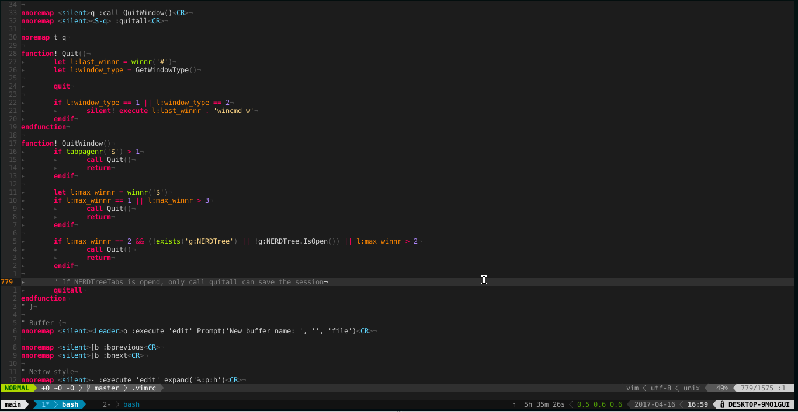
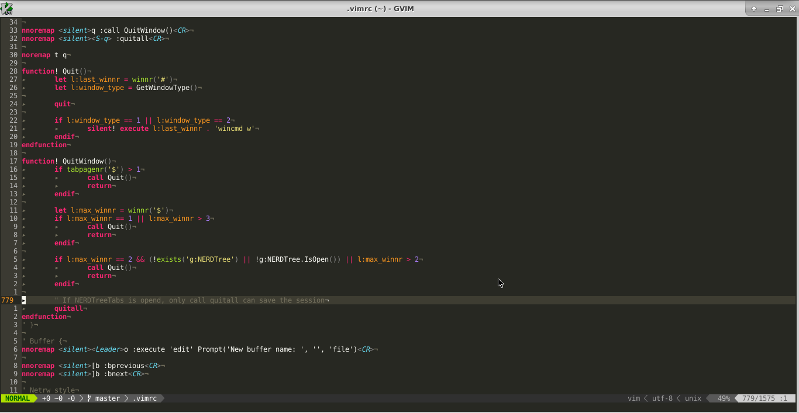

# monkey-vim

其他语言版本：[English](README.md)

## 简介

monkey-vim项目，旨在打造一个强大，快速并且跨平台的IDE。

## 截图

- **xterm vim**



- **gvim**



## 要求

- vim 8.0+

## 安装步骤

### 1. clone到本地

```bash
git clone https://github.com/QMonkey/monkey-vim.git
```

### 2. 安装依赖

#### 2.1 工具依赖

```bash
# Ubuntu
sudo apt-get install ctags
sudo apt-get install cmake
sudo apt-get install silversearcher-ag 或 sudo apt-get install ack-grep
sudo apt-get install wmctrl
sudo apt-get install parcellite

# OpenSUSE
sudo zypper install ctags
sudo zypper install cmake
sudo zypper install the_silver_searcher 或 sudo zypper install ack
sudo zypper install wmctrl
sudo zypper install parcellite

# CentOS
sudo yum install ctags
sudo yum install cmake
sudo yum install the_silver_searcher 或 sudo yum install ack
sudo yum install wmctrl
sudo yum install clipit

# Mac
brew install ctags
brew install cmake
brew install the_silver_searcher 或 brew install ack

# Windows
Visual Studio（必须安装C++组件）
7-zip
ctags
cmake
ag
```

#### 2.2 Fonts

- [Hack](https://github.com/chrissimpkins/Hack)

#### 2.3 Docset

- [Dash](https://kapeli.com/dash/)
- [Zeal](https://zealdocs.org/)

#### 2.4 C/C++

```bash
# Ubuntu
sudo apt-get install gcc
sudo apt-get install g++
# x取决于你要安装的版本
sudo apt-get install clang-format-3.x

# OpenSUSE
sudo zypper install gcc
sudo zypper install gcc-c++
sudo zypper install llvm-clang

# CentOS
sudo yum install gcc
sudo yum install gcc-c++
sudo yum install clang

# Mac
brew install clang

# Windows
gcc
g++
clang
```

#### 2.5 Javascript

```bash
sudo npm install -g jshint
sudo npm install -g js-beautify
sudo npm install -g tern
```

#### 2.6 JSON

```bash
sudo npm install -g jsonlint
```

#### 2.7 Python

```bash
sudo pip install jedi
sudo pip install autopep8 或 sudo pip install yapf
sudo pip install flake8
```

#### 2.8 Golang

```bash
# 请安装最新版本的go

# 其他golang依赖工具
# monkey-vim 安装成功后，执行以下vim命令
:GoInstallBinaries
```

#### 2.9 Java

```bash
# 请安装oracle jdk

# Ubuntu
sudo apt-get install astyle

# OpenSUSE
sudo zypper install astyle

# CentOS
sudo yum install astyle

# Mac
brew install astyle

# Windows
astyle
```

#### 2.10 Lua

```bash
# Ubuntu
sudo apt-get install lua

# OpenSUSE
sudo zypper install lua

# CentOS
sudo yum install lua

# Mac
brew install lua

# Windows
lua
```

#### 2.11 Ruby

```bash
sudo gem install rubocop
sudo gem install ruby-beautify
```

#### 2.12 PHP

```bash
# Ubuntu
sudo apt-get install php
pear install PHP_CodeSniffer

# CentOS
sudo yum install php
pear install PHP_CodeSniffer

# OpenSUSE
sudo zypper install php
pear install PHP_CodeSniffer

# Mac
brew install php
pear install PHP_CodeSniffer

# Windows
php
pear install PHP_CodeSniffer
```

#### 2.13 Shell

```bash
# Ubuntu
sudo apt-get install shellcheck

# OpenSUSE
sudo zypper install ShellCheck

# CentOS
sudo yum install ShellCheck

# Mac
brew install shellcheck
```

#### 2.14 Markdown

```bash
sudo pip install proselint
sudo npm install -g livedown
sudo npm install -g remark-cli
```

#### 2.15 Vim

```bash
sudo pip install vim-vint
```

### 3. 安装

- Linux和Mac

```bash
cd monkey-vim
ln -s $(pwd)/.vimrc ~/.vimrc
vim
```

- Windows

```bash
cd monkey-vim
mklink %HOMEDRIVE%%HOMEPATH%\.vimrc %CD%\.vimrc
vim
```

## 更新

```bash
cd monkey-vim
git pull
```

```vim
:PlugInstall
:PlugUpdate
:PlugUpgrade
:PlugClean
```

## 快捷键

```
以下所有“Leader”键，都代表“,”键
```

### 1. 正常模式

#### 1.1 按键修改

```
s       用剪贴板的内容替换文本对象选中的字符串
S       用剪贴板的内容替换当前光标到行尾的文本
Y       复制到行尾，相当于“y$”命令
H       跳到当前行第一个非空字符,相当于“^”命令
L       跳到当前行最后一个非空字符,相当于“$”命令
U       Redo，相当于“Ctrl-r”
;       进入命令行模式，相当于“:”键
q       退出窗口，相当于命令“:q”
Q       退出vim，相当于命令“:qa”
t       记录操作，相当于原来的q
```

#### 1.2 F2 ~ F10

```
F2      打开/关闭NERDTree
F7      异步运行当前项目（可用:FocusDispatch注册执行的命令，如:FocusDispatch gcc % -o a.out）
F8      打开/关闭F7运行结果
F9      运行当前文件
F10     预览Markdown
F11     全屏切换（仅在gui模式下有效）
```

#### 1.3 缓冲

```
Leader+o    输入打开文件的路径，并在当前窗口打开一个缓冲
[+b         切换到上一个缓冲
]+b         切换到下一个缓冲

-           在当前窗口打开文件所在的文件夹
~           在当前窗口打开项目根路径，或者文件所在的文件夹
```

#### 1.4 分屏

```
Leader+s    输入打开文件的路径，并创建一个水平分屏的窗口
Leader+v    输入打开文件的路径，并创建一个垂直分屏的窗口

Ctrl+h      跳转到左窗口
Ctrl+j      跳转到下窗口
Ctrl+k      跳转到上窗口
Ctrl+l      跳转到右窗口

up          窗口垂直方向伸展
down        窗口垂直方向收缩
left        窗口水平方向伸展
right       窗口水平方向收缩
Leader+z    窗口放大/恢复
```

#### 1.5 Tab

```
Leader+t      输入打开的文件路径，并创建一个新tab窗口

[+t         切换到上一个tab窗口
]+t         切换到下一个tab窗口
Leader+1~9  切换到第1~9个tab窗口
Leader+[    切换到第一个tab窗口
Leader+]    切换到最后一个tab窗口
```

#### 1.6 查找

```
#       正向查找光标所在的单词
*       逆向查找光标所在的单词
```

#### 1.7 替换

```
# '\r'代表换行

Leader+R    替换光标所在的单词（非整词，不需要逐一确认）
Leader+rw   替换光标所在的单词（整词，不需要逐一确认）
Leader+rc   替换光标所在的单词（非整词，需要逐一确认）
Leader+rcw  替换光标所在的单词（整词，需要逐一确认）
```

#### 1.8 语言相关

```
K                   查看光标所在的单词在文档中的解释。（若文件类型为c,sh,vim，则打开split查看。否则打开dash或zeal查看。）
Leader+Leader+z     输入语言类型和关键字，在dash或zeal中查看相应的解释

gd              定义跳转
Leader+gr       跳转到引用标识符的地方。只支持golang，python和javascript

# Golang
Leader+gb       GoBuild，构建当前包
Leader+gi       GoImplements，显示光标所在接口的实现
Leader+gd       GoDescribe, 描述光标所在语法：定义、方法等
Leader+gr       GoReferrers, 显示光标所在标识的所有引用
Leader+gn       GoRename, 重命名光标所在标识
Leader+gw       GoWhicherrs, 显示光标所在错误的所有类型
Leader+gc       GoChannelPeers, 显示光标所在channel的读写操作
Leader+gt       GoTest，执行当前go文件的单元测试
Leader+gf       GoTestFunc，执行光标所在的单元测试函数
Leader+ga       GoAlternate，在源文件和单元测试间切换
```

#### 1.9 Ctags

```
Ctrl+]  跳转到符号定义处，如有多处定义，则跳到第一处
g]      选择一处符号定义并跳转
```

#### 1.10 Fold

```
za      当光标下的折叠打开时，关闭它。当折叠关闭时，关闭它
zc      关闭光标下的折叠
zo      打开光标下的折叠
zR      打开所有折叠
zM      关闭所有折叠
```

#### 1.11 Marks

```
m[a-zA-Z]   添加/删除标记
m,          添加下一个可用的标记
m.          如果当前行没有标记，添加下一个可用标记。否则，删除第一个标记

dm[a-zA-Z]  删除标记[a-zA-Z]
m-          删除当前行的所有标记
m<Space>    删除当前buffer的所有标记

'[a-zA-Z]   跳转到标记[a-zA-Z]
]`          跳转到下一个标记
[`          跳转到上一个标记
`]          根据字母序列跳转到下一个标记
`[          根据字母序列跳转到上一个标记
m/          在Location List里，查看当前buffer的所有标记

m[0-9]      添加/删除自定义标记!@#$%^&*()

m<S-[0-9]>  删除相应的自定义标记
m<BS>       删除所有自定义标记

]-          跳转到下一个相同类型的自定义标记
[-          跳转到上一个相同类型的自定义标记
]=          跳转到下一个自定义标记
[=          跳转到上一个自定义标记
m?          在Location List里，查看当前buffer的所有自定义标记
```

#### 1.12 代码补全，定义、声明跳转插件：[YouCompleteMe](https://github.com/Valloric/YouCompleteMe)

```
gd          跳转到定义
Leader+jd   跳转到声明
Leader+jt   跳转到头文件，定义或声明
```

#### 1.13 异步语义语法检查插件：[ale](https://github.com/w0rp/ale)

```
Leader+l    打开/关闭错误信息窗口
```

#### 1.14 快速移动插件：[vim-sneak](https://github.com/justinmk/vim-sneak)

```
f           搜索当前屏幕两个字符，并跳转到指定字符
F           与“f”功能相同但方向相反
```

#### 1.15 buffer、tab切换，保存/恢复workspace插件：[vim-ctrlspace](https://github.com/vim-ctrlspace/vim-ctrlspace)

```
Ctrl+Space  打开CtrlSpace

Leader+bs   保存workspace
Leader+rs   恢复workspace
```

#### 1.16 项目文件搜索插件：[ctrlp.vim](https://github.com/ctrlpvim/ctrlp.vim)

```
Ctrl+p      搜索文件
Ctrl+t      搜索当前buffer的tags
Ctrl+n      搜索整个工程的tags
```

#### 1.17 项目代码搜索插件：[ack.vim](https://github.com/mileszs/ack.vim)

```
Leader+a        当前目录搜索光标所在的词
```

#### 1.18 注释插件：[nerdcommenter](https://github.com/scrooloose/nerdcommenter)

```
Leader+cl       注释光标所在行
Leader+cu       取消注释
```

#### 1.19 围绕字符编辑插件：[vim-surround](https://github.com/tpope/vim-surround)

```
ys+textobj+surroundA        在textobj指定的范围增A围绕字符
yss+surroundA               在当前行增加A围绕字符
ds+surroundA                删除A围绕字符
cs+surroundA+surroundB      将A围绕字符改成B围绕字符
```

#### 1.20 运行代码插件：[vim-quickrun](https://github.com/thinca/vim-quickrun)

```
Leader+ru       运行当前文件
```

#### 1.21 其他

```
'.              最后一次变更的地方
''              跳回来的地方（最近两个位置跳转）
Ctrl+o          跳回，可用于多种类型跳转（符号跳转，定义跳转，屏幕跳转等）
Ctrl+i          继续上次跳转（与Ctrl+o操作相反），可用于多种类型跳转（符号跳转，定义跳转，屏幕跳转等）
Leader+f        在NERDTree中显示当前文件
cod             切换diff模式
cop             切换paste模式
col             切换list模式
coa             切换自动格式化代码
[+<Space>       在光标之上添加n个空行
]+<Space>       在光标之下添加n个空行
Leader+cd       切换到当前文件所在项目根路径
Leader+/        取消搜索高亮
Leader+space    去除行尾空白字符
Leader+q        打开/关闭quickfix
Leader+l        打开/关闭location list
```

### 2. 插入模式

#### 2.1 按键修改

```
t       记录操作，相当于原来的q
Ctrl+d  删除当前行
Ctrl+k  删除到行尾
```

### 3. 可视化模式

#### 3.1 按键修改

```
s       用剪贴板的内容替换选中文本
;       进入命令行模式，相当于“:”键
```

#### 3.2 查找

```
#       正向查找选中的字符串
*       逆向查找选中的字符串
```

#### 3.3 替换

```
# '\r'代表换行

Leader+R    替换选中的字符串（不需要逐一确认）
Leader+rc   替换选中的字符串（需要逐一确认）
```

#### 3.4 语言相关

```
K       查看所选字符串在文档（若文件类型为c,c++,sh,go,python,ruby,php,vim，则打开split查看。否则打开dash或zeal查看。）中的解释
```

#### 3.5 快速移动插件：[vim-sneak](https://github.com/justinmk/vim-sneak)

```
f           搜索当前屏幕两个字符，并跳转到指定字符
F           与“f”功能相同但方向相反
```

#### 3.6 项目代码搜索插件：[ack.vim](https://github.com/mileszs/ack.vim)

```
Leader+a        当前目录搜索选中字符串
```

#### 3.7 注释插件：[nerdcommenter](https://github.com/scrooloose/nerdcommenter)

```
Leader+cl       注释选中的代码
Leader+cu       取消选中代码的注释
```

#### 3.8 围绕字符编辑插件：[vim-surround](https://github.com/tpope/vim-surround)

```
S+surroundA     选中字符串增加A围绕字符
```

#### 3.9 运行代码插件：[vim-quickrun](https://github.com/thinca/vim-quickrun)

```
Leader+ru       运行选中代码
```

### 4. 命令行模式

```
Ctrl+j  下一条命令
Ctrl+k  上一条命令
Ctrl+a  跳到命令行最前
Ctrl+e  跳到命令行最后
```

## 常用命令

### 1. W

```vim
" 使用root权限保存文件
:W
```

### 2. Ack

```vim
" 递归搜索包含test的代码，搜索结果加载到quickfix。":Ack"命令会打开第一个搜索结果
:Ack[!] {pattern}

" 同Ack，但搜索结果加载到location list
:LAck[!] {pattern}
```

### 3. UpdateTags

```vim
" 为当前文件生成tag
:UpdateTags

" 为整个工程生成tag
:UpdateTags -R
```

### 4. YcmGenerateConfig

```vim
" 为整个工程生成.ycm_extra_conf.py文件
:YcmGenerateConfig
```

### 5. Locate

```vim
" 使用"locate"命令搜索文件，搜索结果加载到quickfix。":Locate"命令会打开第一个搜索结果
:Locate[!] {args}
```

## 在vim中使用git

### 1. git for vim: [vim-fugitive](https://github.com/tpope/vim-fugitive)

```vim
" 相当于:!git [args]
:Git [args]

" 相当于git status。“g?”命令查看Gstatus窗口支持的操作
:Gstatus

" 相当于git commit
:Gcommit [args]

" 相当于git merge，错误和冲突会加载到quickfix（Leader+q快捷键打开）
:Gmerge [args]

" 相当于git pull
:Gpull [args]

" 相当于git fetch
:Gfetch [args]

" 相当于git push
:Gpush [args]

" 相当于git grep
:Ggrep [args]

" 在非Gdiff模式下相当于git checkout。args为空的情况下，相当于git checkout %
:Gread [path]

" 在非Gdiff模式下相当于git add。args为空的情况下，相当于git add %
:Gwrite [path]

" 相当于git mv % {destination}
:Gmove {destination}

" 相当于git rm %
:Gremove

" 使用vimdiff展示git diff
:Gdiff [args]

" 将当前文件所有历史提交记录加载到quickfix
" 若带有“--”参数，则展示某次commit的full-diff，而不是历史版本
:Glog [args]

" 同:Glog，把提交记录加载到location list（Leader+l快捷键打开），而不是quickfix
:Gllog [args]

" 同:Glog，但只针对指定范围（可在可视化模式下使用）
:{range}Glog [args]

" vsplit打开git blame的结果。“g?”命令查看Gblame窗口支持的操作
:Gblame [flags]

" 同:Gblame，但只针对指定范围（可在可视化模式下使用）
:{range}Gblame [flags]

" 详细教程请参考以下视频
https://github.com/tpope/vim-fugitive#screencasts

" 或官方文档
:h fugitive.txt
```

### 2. gitk for vim: [gitv](https://github.com/gregsexton/gitv)

```vim
" 文件模式，显示当前文件的所有历史版本。以split的方式打开Gitv，只显示与当前文件相关的提交
" args为git log所支持的参数
:Gitv! [args]

" 同:Gitv!，但只显示与选中行相关的提交（可在可视化模式下使用）
:{range}Gitv! [args]

" 浏览器模式，显示所有提交的git diff。以tab的方式打开Gitv
:Gitv [args]

" 详细教程请参考官方文档
:h gitv.txt
```

## 注意事项

- monkey-vim默认tab的缩进为8个字符，不使用space替代tab。如果你喜欢tab缩进为4个字符，并且使用space替代tab。你可以将以下vim配置

```vim
set tabstop=8
set softtabstop=8
set shiftwidth=8
set noexpandtab
```

改为

```vim
set tabstop=4
set softtabstop=4
set shiftwidth=4
set expandtab
```

## 推荐设置

- [源码构建vim](https://github.com/QMonkey/monkey-vim/wiki/Build-Vim-from-source)

- 在bashrc中加入以下Shell代码，即可在vim中查看man文档

```bash
export MANPAGER="env MAN_PN=1 vim -R --cmd 'let g:CtrlSpaceLoaded = 1' +MANPAGER -"
```

- 将Caps Lock按键映射为Ctrl

```bash
# Linux
# 新建10-caps2ctrl.conf文件，内容如下，并放到/etc/X11/xorg.conf.d/目录下
Section "InputClass"
        Identifier             "keyboard-layout"
        MatchIsKeyboard        "on"
        Option "XkbOptions"    "ctrl:nocaps"
EndSection

# Mac
# 打开系统偏好设置 -> 键盘 -> 键盘Tab窗口 -> 修改键，并将Caps Lock改成Control

# Windows
# 以管理员权限运行并重启
$hexified = "00,00,00,00,00,00,00,00,02,00,00,00,1d,00,3a,00,00,00,00,00".Split(",") | % { "0x$_"}
$kbLayout = "HKLM:\System\CurrentControlSet\Control\Keyboard Layout"
New-ItemProperty -Path $kbLayout -Name "Scancode Map" -PropertyType Binary -Value ([byte[]]$hexified)
```

## FAQ

- 防止Vim在退出时清除剪贴板

打开parcellite **Preference>Display**，并且勾选“Persistent History”


- [FAQ](https://github.com/QMonkey/monkey-vim/wiki/FAQ.zh_CN)

## 意见或建议

如果你对monkey-vim项目有什么意见或建议，欢迎给我个[issue](https://github.com/QMonkey/monkey-vim/issues)
